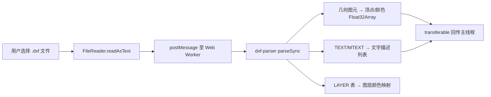
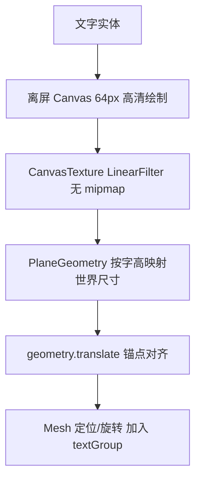

# DXF Web 查看器 (dxfview) 架构设计

本文档记录 `dxfview/` 子目录下独立的 **Vue3 + Vite + Three.js 网页版 DXF 查看器**的架构设计、文字渲染管线与单文件构建方案。该查看器用于在浏览器中直接预览本项目转换产出的 DXF 图纸（线条 + 文字标注），也可作为未来集成进 Electron 主应用的预览组件。

---

## 1. 项目定位与技术栈

| 维度 | 选型 |
|---|---|
| 前端框架 | Vue 3 (`<script setup>` 组合式 API) |
| 构建工具 | Vite 8 + `@vitejs/plugin-vue` |
| 渲染引擎 | Three.js（`OrthographicCamera` + `MapControls`） |
| DXF 解析 | `dxf-parser`（运行于 Web Worker，不阻塞主线程） |
| 单文件构建 | `vite-plugin-singlefile` |

目录结构：
```
dxfview/
├── index.html
├── vite.config.js          # base './' + viteSingleFile
├── src/
│   ├── main.js
│   ├── App.vue
│   ├── components/DxfViewer.vue      # Three.js 视口 + 文字纹理渲染
│   └── workers/dxfParser.worker.js   # Web Worker 解析管线
└── dist/index.html         # 构建产物：单文件自包含
```

---

## 2. 解析管线 (Web Worker)



### 2.1 几何图元提取
`dxfParser.worker.js` 两遍扫描实体列表：
1. **计数遍**：统计 LINE（2 顶点）、LWPOLYLINE/POLYLINE（`(n-1)*2`，闭合 `shape` 标记再加 2）、ARC/CIRCLE（64 段 × 2 顶点）的总顶点数，一次性分配 `Float32Array`；
2. **填充遍**：写入位置与逐顶点颜色，最终以 `transferable` 零拷贝回传主线程。

### 2.2 图层颜色解析
实体颜色按以下优先级解析为 24 位整型：
1. 实体自身 `colorNumber`（ACI 索引，0 与 256/BYLAYER 跳过）；
2. 实体所属图层在 LAYER 表中的 `color`（24 位）或 `colorIndex`（ACI）；
3. 兜底白色。

这使转换产物的图层配色在网页端与 CAD 中一致：`TEXTS` 绿色、`POLYLINES` 青色、`LINES`/`RECTS` 白色。

### 2.3 文字实体提取与特殊码清洗
TEXT / MTEXT 实体提取为 `{ text, x, y, height, rotation, color, halign/valign | attachmentPoint }` 描述对象。文本内容经 `cleanDxfText` 清洗：
- `\U+xxxx` Unicode 转义还原；
- `%%c` → Ø、`%%d` → °、`%%p` → ±、`%%u` 下划线开关剔除；
- MTEXT 段落符 `\P` → 换行；格式控制码（`\f...;`、`\H...;` 等）与花括号分组剔除。

对齐锚点遵循 DXF 规范：`halign/valign` 均为 0 时以 `startPoint`（组码 10）为插入点，否则以 `endPoint`（组码 11）为对齐锚点；MTEXT 使用 `attachmentPoint`（1~9 九宫格）。

---

## 3. 渲染管线 (Three.js)

### 3.1 线条：单次 Draw Call
全部线段合并为唯一的 `BufferGeometry` + `LineSegments`（`vertexColors: true`），数十万图元仍保持个位数 Draw Call。加载后按包围盒中心平移至原点，正交相机视锥按 `maxDim * 1.1` 自适应铺满视口。

### 3.2 文字：Canvas 纹理平面网格
每个文字实体生成独立的 `Mesh`（PlaneGeometry + CanvasTexture）：



关键设计：
- **字高映射**：DXF 字高定义为大写字母高度，画布字体以 `CAP_RATIO = 0.72`（em 与 cap 高度比）换算 `worldPerPixel = height / (0.72 × FONT_PX)`，保证文字在世界空间中的物理尺寸与 CAD 一致，正交相机缩放时保持清晰；
- **锚点归一**：依据 `halign/valign` 或 MTEXT `attachmentPoint` 计算锚点在平面上的局部坐标，`geometry.translate(-anchorX, -anchorY)` 将锚点移到局部原点，`mesh.position` 即为 DXF 插入点，旋转（`rotation.z`）围绕插入点进行；
- **多行支持**：`\P` 换行按 `LINE_HEIGHT = 1.2 × FONT_PX` 行距逐行绘制；
- **渲染状态**：`transparent: true`、`depthWrite: false`、`z = 1`（线条 `z = 0`），避免与线段 Z-fighting；
- **资源回收**：重新加载文件时遍历 `textGroup` 释放 geometry / material / texture，防止显存泄漏。

### 3.3 交互
`MapControls`（禁用旋转，保留阻尼平移与滚轮缩放）提供图纸浏览能力；窗口尺寸变化时按固定视锥高度重算正交相机左右边界，保持纵横比。

---

## 4. 单文件构建与部署

为支持**双击直接打开**与未来经 `loadFile` 集成进 Electron，构建配置做了三处关键处理（`vite.config.js`）：

| 配置 | 作用 |
|---|---|
| `base: './'` | 资源引用改为相对路径，摆脱站点根路径依赖 |
| `?worker&inline`（worker 导入后缀） | Worker 代码以 base64 内嵌进主 bundle，运行时经 Blob 实例化，不再产出独立 worker 文件（file:// 下独立 worker 会被浏览器安全策略拦截） |
| `vite-plugin-singlefile` | JS/CSS 全部内联进 `dist/index.html`（约 635 KB），产物零外部依赖 |

> 注意：浏览器对 `file://` 协议下的外部 `<script type="module">` 有 CORS 限制，因此必须内联为单文件才能双击打开；HTTP 服务（`npm run dev` / `npm run preview`）下两种形态均可正常工作。

---

## 5. 验证记录

以真实转换产物 `[BA22015S-U0101-02]光缆路由现状图.dxf`（374 KB，1250 实体）在 dev 与 dist 两种模式下回归验证：

- 解析：1250 实体（353 LINE / 440 LWPOLYLINE / 134 TEXT / 323 其他），顶点缓冲 2500 顶点；
- 渲染像素统计：非背景像素 55858，其中绿色文字像素 19548、白色线条像素 17072；
- 控制台零报错，worker 请求正常；
- 站名、光缆规格标注、图例、标题栏文字均清晰可读，颜色与图层定义一致。
