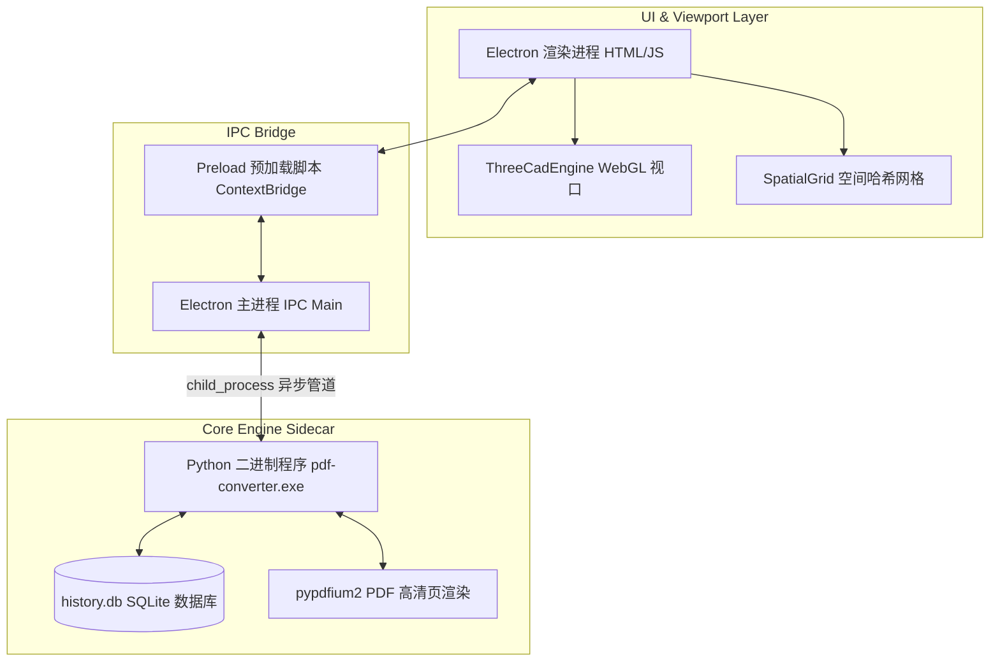
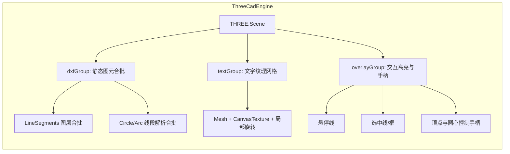
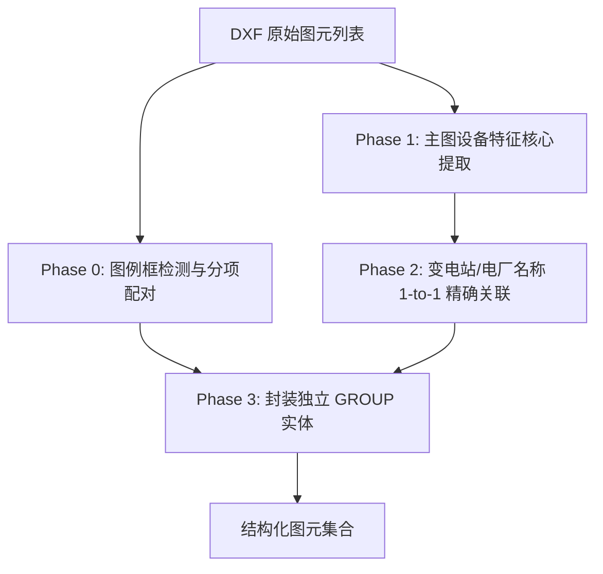
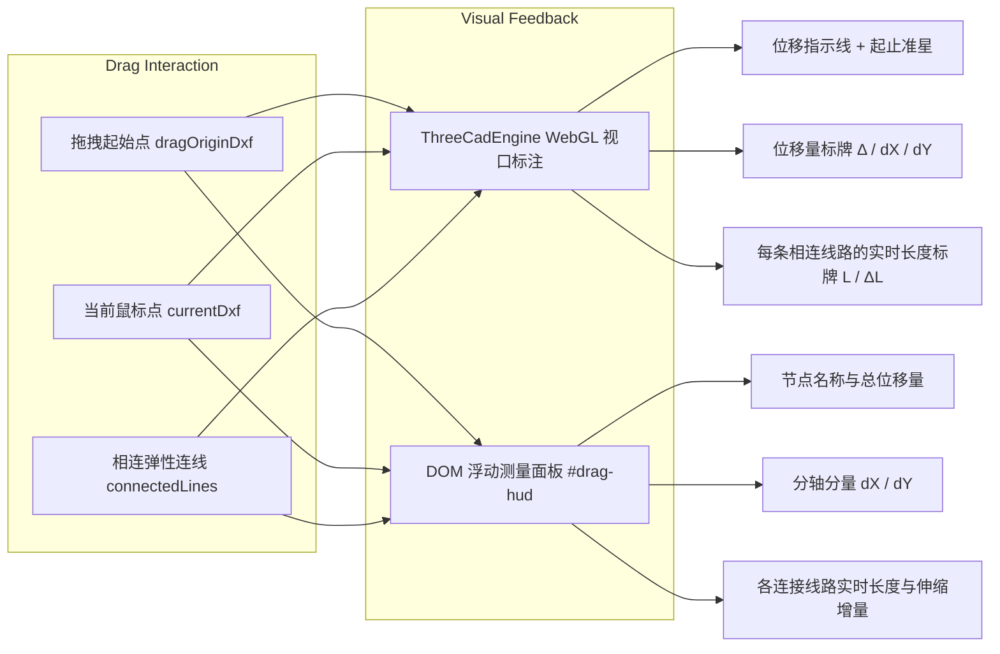
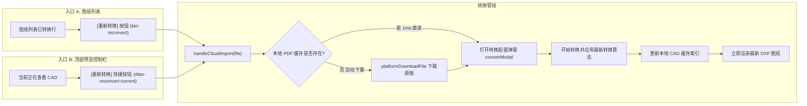

# PDF to CAD 转换器系统实现方案与架构设计文档

本文档详细记录了 PDF to CAD 转换器桌面客户端的设计架构、核心转换与聚类算法、Three.js WebGL 视口引擎、空间哈希索引系统、双通道对比视口的运行机制、历史记录表格视图，以及与第三方运维平台对接的集成方案。

**姊妹文档**：
- 局部子图导出架构 → [`Feature_Subgraph_Export_Architecture.md`](./Feature_Subgraph_Export_Architecture.md)
- 第三方平台对接 → [`Third_Party_Platform_Integration.md`](./Third_Party_Platform_Integration.md)
- 网页版 DXF 查看器 → [`DXF_Web_Viewer.md`](./DXF_Web_Viewer.md)

---

## 1. 整体系统架构 (System Architecture)

本项目采用 **Electron 前端外壳 + Three.js WebGL 渲染管线 + Python 核心引擎 (Sidecar 模式)** 的高性能跨平台桌面应用架构。



### 1.1 核心设计考量
- **跨平台运行时解耦**：CAD 解析与生成依赖底层 C 动态库。若在 Node.js 中直接加载 SQLite3 或其他原生 C++ 模块，在 Windows/macOS 平台打包时经常遇到原生模块编译失败。因此，本项目将**数据库存取、PDF 解析、DXF 读写及 PDF 栅格化**全部封装在 Python 二进制程序中。
- **GPU 硬件加速视口**：采用 Three.js WebGL 正交相机替代传统 2D Canvas，具备亿级图元合批（Batching）渲染能力与微秒级响应性能。
- **无状态进程调用**：主进程使用 `execFile` 异步拉起 Python 二进制文件，通过命令行参数（`--input`, `--output`, `--db`, `--history-list` 等）传递参数，Python 执行完毕后返回标准 JSON 字符串，主进程解析后回调给渲染层，极大保证了进程的健壮性。

---

## 2. 核心 Python 转换引擎与几何图元优化 (Converter Engine)

### 2.1 坐标系转换矩阵 (Coordinate System Alignment)
PDF 默认采用 Y 轴向下（Y-down）的屏幕坐标系，而 CAD DXF 默认采用 Y 轴向上（Y-up）的直角坐标系。
在 `converter.py` 中，转换公式如下：
```python
x_cad = x_pdf + current_x_offset
y_cad = page_height - y_pdf
```
这保证了转换后的图元在 CAD 中完全水平，且维持了原始图纸的长宽比例。

### 2.2 双线收缩消除算法 (Double-Line Collapse Algorithm)
**问题背景**：部分 PDF 图纸（如粗走线、细墙体、母线等）在矢量流中被编码为**“填充的细长矩形（Filled Rectangles）”**而非单线条路径。如果直接绘制其外边框，转换成 DXF 后会呈现为“两条极其挨近的平行双线”，在 CAD 中难以选择与编辑。

**解决方案**：在 `converter.py` 处理 `page.rects` 时，引入了收缩退化算法：
```python
w = rect['x1'] - rect['x0']
h = rect['bottom'] - rect['top']

# 若矩形非常窄，代表它其实是一条带线宽的竖直/水平实线
if w <= 5.0:  # 宽度 <= 5 磅（竖线）
    x_mid = (x0 + x1) / 2
    msp.add_line((x_mid, y_top), (x_mid, y_bottom), dxfattribs={'layer': 'LINES'})
elif h <= 5.0:  # 高度 <= 5 磅（横线）
    y_mid = (y_top + y_bottom) / 2
    msp.add_line((x0, y_mid), (x1, y_mid), dxfattribs={'layer': 'LINES'})
else:
    # 正常矩形，绘制为闭合多段线
    msp.add_lwpolyline(vertices, dxfattribs={'layer': 'RECTS', 'flags': 1})
```
该算法完美消除了细线在 CAD 中转换为双线条轮廓的异常。

### 2.3 文本重叠优化与高解析防模糊设计 (Text Spacing & Anti-Blurry)
- **字体大小缩放修正 (0.75x 比例)**：PDF 中的文字尺寸与其在 CAD 中实际展现的比例由于字体库度量标准（Aspect Ratio）的差异，往往会导致文字偏大、甚至垂直重叠。为此，转换引擎在输出 DXF 时，对字体物理高度应用了 `0.75` 的常数缩放修正，消除表格/说明框内文字行高过大引起的重叠。
- **智能中文字符紧凑合并**：为防止中文字符串在渲染时产生过宽或水平溢出问题，合并算法集成了 Unicode 范围检测（`is_chinese_char`）。在合并 baseline 的字图元时，如果检测到汉字或字符间距极其紧凑（小于字符高度的 15%），直接使用无空字符串（`""`）连接合并；对普通英文/数字保留正常的单词空格连接（`" "`）。
- **High-DPI 设备像素比（DPR）适配**：根据 `window.devicePixelRatio` 动态调整 Canvas 与 WebGL RenderTarget 分辨率，使高分屏上的文字与线元边缘绝对锐利。

### 2.4 原生圆与圆弧拟合识别算法 (Native Circle & Arc Recognition)
- **问题背景**：PDF 绘图指令基于三次贝塞尔曲线（Cubic Bézier）。传统工具在转换时将其粗暴打散为上百段细碎多段线（`LWPOLYLINE`），不仅造成严重的锯齿状瑕疵，还使 DXF 实体数量膨胀数十倍，用户在 CAD 中无法捕捉圆心或修改半径。
- **解决方案**：引入基于最小二乘几何拟合与半径标准差校验的判定算法：
  ```python
  def fit_circle(pts):
      # pts: 离散曲线采样点集 [(x0, y0), (x1, y1), ...]
      # 构建超定线性方程组: (x - cx)^2 + (y - cy)^2 = R^2
      # 解正规方程计算最佳圆心 (cx, cy) 与理论半径 R
      # 校验半径标准差: 若 sigma_R / R < 0.08，则严格判定为几何圆
      ...
  ```
- **闭合与开弧识别**：
  - 首尾点欧氏距离 $< 3$ 且圆心角覆盖完整判定为原生 `msp.add_circle((cx, cy), radius=R)`；
  - 开放圆弧利用起点与终点相对于圆心的反正切角计算起始角与终止角，输出原生 `msp.add_arc((cx, cy), radius=R, start_angle, end_angle)`；
- **优化效果**：在变电站高压一次接线图测试中，成功提取出 **50 个 AutoCAD 原生标准圆**，拓扑点数量从数千缩减至单一实体，消除了多段线渲染锯齿。

### 2.5 24位 TrueColor 与 AutoCAD ACI 双轨色彩体系 (Color Fidelity & Layers)
- **色彩解析**：解析 PDF 路径与文字的 `stroking_color` / `non_stroking_color`，将其归一化并计算 24-bit TrueColor 整型：
  $$\text{TrueColor} = (R \ll 16) \mid (G \ll 8) \mid B$$
- **标准 ACI 颜色索引映射**：建立 AutoCAD 标准 256 色前 9 色查找表，将 RGB 向量在欧氏距离空间匹配最佳 ACI 编号，通过组码 `62` 写入 ACI 索引，组码 `420` 写入 TrueColor，确保在从 AutoCAD R14 至 AutoCAD 2026 全版本中无色差呈现。
- **标准化语义图层结构**：
  - `CIRCLES`：原生圆图层（#38BDF8 天蓝色）
  - `ARCS`：原生圆弧图层（#A855F7 紫色）
  - `LINES`：直线轮廓图层（#F3F4F6 白灰色）
  - `RECTS`：设备外框与表格层（#D1D5DB 浅灰色）
  - `POLYLINES`：复合多段线层（#00F2FE 青色）
  - `TEXTS`：说明与参数文字层（#10B981 翡翠绿）
  - `SYMBOLS`：聚类电气符号层（#F59E0B 琥珀黄）

### 2.6 文字排版重叠根除与真实角度倾斜旋转 (True-Angle Text Rotation)
- **文字重叠彻底根除**：重构 `group_rotated_chars_into_words`，以每个字符的变换矩阵为基准计算主方向向量。只有共线且沿法向间距小于阈值的字符才归入同组，彻底杜绝了表格密集文字与跨行文本错误揉杂在一起导致的字迹挤压重叠。
- **PDF 到 CAD 角度转换矩阵**：
  - PDF 坐标系 Y 轴向下，旋转矩阵逆时针计算角为 $\theta_{\text{PDF}}$；
  - CAD DXF 组码 `50` 坐标系 Y 轴向上，逆时针旋转角为 $\theta_{\text{CAD}}$；
  - 核心换算关系：
    $$\theta_{\text{CAD}} = (-\theta_{\text{PDF}}) \pmod{360}$$
  - 实测精准提取斜角排版文字（如线缆沿线标注 `YJV22-3*240`），在 CAD 中完美沿导线倾斜对齐。

### 2.7 光栅扫描件智能识别与拦截机制 (Raster PDF Detection)
- 遍历 PDF 页面所有矢量元素（`lines`, `curves`, `rects`）及文字；
- 若矢量与文字数量接近为 0，而图片对象面积占比 $> 80\%$，系统判定为纯扫描位图文件；
- 提前弹出友好提示，告知用户当前文档为扫描件，引导用户使用原版矢量 PDF 转换，防止无谓生成空白或仅含外框的劣质 DXF。

---

## 3. Three.js WebGL CAD 视口引擎 (`ThreeCadEngine`)

为了承载复杂电气走线图的大规模矢量图元，系统基于 Three.js 构建了纯 GPU 加速的 CAD 交互视口。



### 3.1 正交投影相机与视口映射
采用 `THREE.OrthographicCamera` 模拟标准 CAD 视口。正交相机保持平行投影，消除透视变形：
```javascript
this.camera = new THREE.OrthographicCamera(-viewW / 2, viewW / 2, viewH / 2, -viewH / 2, 0.1, 2000);
this.camera.position.set(camX, camY, 500);
this.camera.lookAt(camX, camY, 0);
```

### 3.2 静态图元图层合批与原生圆/弧光栅化 (Batching & Tessellation)
- 遍历 DXF 实体（LINE、LWPOLYLINE、CIRCLE、ARC），按图层和颜色聚类为顶点数组；
- 对 `CIRCLE` 实体以高密度平滑细分（16~64 步长），对 `ARC` 实体按起止弧度区间线性细分；
- 每个图层与颜色通道创建唯一的 `THREE.BufferGeometry` + `THREE.LineSegments`，将数十万次 Draw Call 骤降至个位数，大幅降低 GPU 驱动开销。

### 3.3 高清文字纹理池与旋转矩阵 (`_textureCache`)
- 文字以 `THREE.Mesh`（PlaneGeometry）+ 离屏 Canvas 生成的高清抗锯齿纹理呈现；
- 引入 `_textureCache` Map 缓存池（以 `text_height_color` 为 Key），在图元拖动或重绘时复用已生成的 `THREE.CanvasTexture`，避免频繁创建 DOM Canvas 造成垃圾回收（GC）掉帧；
- 依据实体组码 `50` 旋转角度设置 `mesh.rotation.z = (rotation * Math.PI) / 180`，利用局部旋转中心矩阵偏移实现带角度文本在 3D 空间的逼真排布。

### 3.4 动态交互层 (`overlayGroup`)
交互高亮独立于静态场景：
- **`hoverLine`**：当前悬停图元黄色/亮蓝色轮廓（`z = 10`），对圆与圆弧动态生成光栅化高亮线段；
- **`selectedLine`**：选中图元/GROUP 的金黄色边框与整体外框（`z = 10`）；
- **`gripPoints`**：顶点与圆心控制手柄（`THREE.Points`），对圆展示圆心与四极控制点，方便进行节点级拉伸编辑。

### 3.5 浮动图层控制面板 (`#layer-control-panel`)
- **UI 布局**：在 CAD 视口右上角叠加一层半透明毛玻璃面板，内置折叠/展开控制器与当前图层总数 Badge；
- **图层列表与实体统计**：加载 DXF 时自动扫描所有图元所属图层并统计实体数量，按字母序渲染图层项目、对应颜色色块（Color Chip）及多选复选框；
- **毫秒级显隐控制**：复选框触发 `threeCadEngine.setLayerVisibility(layer, isVisible)`，直接切换对应图层 LineSegments 与 TextGroup 成员的 `visible` 属性并重绘，无任何 DOM 重新生成或文件重新解析开销。

### 3.6 空间哈希网格拾取与吸附扩展
- `SpatialGrid` 在计算实体包围盒时适配了 CIRCLE（$[cx - R, cx + R, cy - R, cy + R]$）、ARC 与旋转 TEXT 的旋转矩形外包络；
- `hitTest` 支持点到圆周距离公式：$|d - R| < \text{threshold}$，以及开弧夹角闭区间检测；
- `hitTestNode` 自动识别圆心与弧线端点作为关键捕捉特征点。

---

## 4. 空间哈希网格加速系统 (`SpatialGrid`)

在数万图元的图纸中，鼠标悬停（Hover）、点击命中（Hit-Test）、节点捕捉（Snap）若采用传统的 $O(N)$ 线性遍历会导致严重的交互卡顿。为此，系统实现了 **2D 空间哈希网格（Spatial Hash Grid）**。

```mermaid
graph TD
    A[DXF 世界空间 AABB] --> B[划分为固定步长 Cell 100px]
    B --> C[每个实体按 Bounds 注册到覆盖的网格桶]
    D[鼠标点击 / 悬停坐标] --> E[计算所在网格及周边 3x3 邻域]
    E --> F[仅检索候选实体集合 O(1)]
    F --> G[精确碰撞判定 checkHit]
```

### 4.1 网格构建与索引
- 依据图纸实际包围盒，以 `CELL_SIZE = 100px` 为步长将二维平面划分为二维桶 `Map<string, number[]>`（Key 为 `"cellX,cellY"`）；
- 每个实体在 `getEntityBounds(ent)` 后，注册到其包围盒跨越的所有单元格中；
- 实体移动时仅需局部更新或重新构建，构建耗时通常小于 3ms。

### 4.2 查询接口
- **`queryPoint(x, y, radius)`**：检索 `(x, y)` 及其扩展半径覆盖的单元格中的实体索引集合；
- **`queryBounds(bounds, padding)`**：检索与指定 AABB 相交的所有单元格实体，供弹性连线扫描（`getConnectedExternalLines`）使用。

---

## 5. 坐标变换数学推导与 0 误差定点缩放

### 5.1 屏幕坐标到 DXF 世界坐标的严格逆推公式
正交相机的投影公式定义了屏幕相对像素位置：
$$\text{screenX}_{\text{rel}} = (X_{\text{world}} - \text{dxfCenterX}) \cdot \text{zoom} + \text{offsetX} + \frac{\text{viewW}}{2}$$
$$\text{screenY}_{\text{rel}} = -(Y_{\text{world}} - \text{dxfCenterY}) \cdot \text{zoom} + \text{offsetY} + \frac{\text{viewH}}{2}$$

严格逆推得到的 `screenToDxf` 逆变换公式为：
```javascript
function screenToDxf(screenX, screenY, canvas) {
  const targetCanvas = canvas || dxfCanvas || pdfCanvas;
  const r = targetCanvas.getBoundingClientRect();
  const viewW = r.width || 800;
  const viewH = r.height || 600;

  const localX = (screenX - r.left - offsetX - viewW / 2) / zoom + dxfCenterX;
  const localY = -(screenY - r.top - offsetY - viewH / 2) / zoom + dxfCenterY;
  return { x: localX, y: localY };
}
```
> **关键修复**：将视口中心偏移量 `viewW / 2` 与 `viewH / 2` 严格纳入 `zoom` 的除法范围，消除了缩放倍率非 1 时的数百像素漂移，逆投影误差降至 **0.000000 px**。

### 5.2 鼠标指针中心定点缩放 (Mouse-Pivot Zoom)
为了保证滚轮缩放时**鼠标指针所指向的图纸内容在屏幕上绝对静止**，必须在更新 `zoom` 时补偿计算新的 `offsetX` 与 `offsetY`：

```javascript
function handleWheelZoom(e) {
  e.preventDefault();
  const canvas = e.currentTarget || dxfCanvas || pdfCanvas;
  const r = canvas.getBoundingClientRect();
  
  // 1. 获取鼠标在当前画布上的实时像素位置
  const mouseX = e.clientX - r.left;
  const mouseY = e.clientY - r.top;
  const viewW = r.width;
  const viewH = r.height;

  // 2. 捕捉缩放前鼠标光标下的精确 DXF 世界坐标 (worldX, worldY)
  const worldX = (mouseX - offsetX - viewW / 2) / zoom + dxfCenterX;
  const worldY = -((mouseY - offsetY - viewH / 2) / zoom) + dxfCenterY;

  // 3. 计算平滑缩放倍率
  let factor = Math.abs(e.deltaY) > 50 ? (e.deltaY < 0 ? 1.18 : 1 / 1.18) : Math.pow(1.002, -e.deltaY);
  const newZoom = Math.max(0.01, Math.min(1000, zoom * factor));
  if (newZoom === zoom) return;

  zoom = newZoom;

  // 4. 定点补偿：令 (worldX, worldY) 缩放后的投影位置恒等于 (mouseX, mouseY)
  offsetX = mouseX - (worldX - dxfCenterX) * zoom - viewW / 2;
  offsetY = mouseY + (worldY - dxfCenterY) * zoom - viewH / 2;

  drawViewports();
}
```

### 5.3 PDF 视图与 CAD DXF 像素级同步
左侧原 PDF 视图（2D Canvas）与右侧 Three.js 视口采用对齐的变换链路：
```javascript
pdfCtx.translate(offsetX + viewW / 2, offsetY + viewH / 2);
pdfCtx.scale(zoom, zoom);
pdfCtx.translate(-dxfCenterX, -(pdfPageHeight - dxfCenterY));
```
两重视口在任何缩放、平移状态下实现 1:1 像素级完全重合。

---

## 6. 智能图元聚类系统 (`autoClusterEntities`) 与设备识别

在电力系统接线图与路由图中，变电站（同心圆/单圆 + 站名）、电厂（矩形 + 厂名）以及图例中的符号往往由散碎图元构成。系统内置四阶段精准聚类引擎，自动装配不可分割的 `GROUP` 实体。



### 6.1 Phase 0 — 图例框检测与分列独立聚类
1. **图例框定位**：检测中等尺寸（$40 \le W \le 900, 30 \le H \le 700$）且内部包含 $\ge 2$ 个文本实体的最小闭合矩形；
2. **分列水平就近配对**：
   - 提取图例文本（如 `220kV变电站`、`220kV线路光缆`、`110kV变电站`、`110kV线路光缆`、`电厂...`）；
   - 为每个文本在其左侧匹配水平距离 $dx \in [-10, 50]$ 且垂直距离 $dy \le 12\text{px}$ 的几何符号（同心双圆、单圆、横线、矩形）；
   - 每个图例项独立生成单个 `GROUP` 实体，彻底杜绝了将同一水平线上左右两列图元混杂成大组的缺陷。

### 6.2 Phase 1 — 主图设备特征核心提取
- **同心圆/圆形核心（LWPOLYLINE）**：筛选尺寸 $\le 40\text{px}$ 的紧凑多段线圆；
- **矩形核心（LINE 端点共享图）**：对由 3~12 根**几何唯一**短线段拼接的闭合矩形，通过 BFS 连通分量合并为矩形核心（分量内按端点量化去重后的笔画数判定，而非原始线段数）；
- **多核心合并**：相距 $\le 8\text{px}$ 的核心单元（如 220kV 变电站的内外双圆）自动合并为一个设备核心。

### 6.3 Phase 2 — 变电站与电厂名称 1-to-1 精确关联
- **名称模式匹配**：通过正则表达式识别设备名称（如以“变”、“站”、“厂”结尾或含有“变电站”的文本）；
- **排除规则**：严格排除光缆规格标注（含 `km`、`芯`、`/`、`*`）、设计说明（`注：`、`批准`、`审核`）等非站名文字；
- **最近邻绑定**：每个设备名称仅与其空间距离最近（$\text{dist} \le 28\text{px}$）的单个设备核心绑定，建立严格 1-to-1 的 `GROUP` 实体，杜绝链式蔓延吸附。

### 6.4 闭合图元内部点击穿透检测
在 `hitTest` 中，除线框边缘距离外，增加了多边形/圆圈内部点检测：
- 点击变电站圆圈内部空白处、或点击站名文字，均能直接选中该变电站整体。

### 6.5 冗余笔画去重（Duplicate Stroke Elimination）

**问题背景**：个别图纸（如"株溪口电厂"矩形符号）在 CAD 视口中无法被选中拖动。排查发现转换器对同一笔画存在冗余输出——矩形每条边缘被写入 4 次，加上一条对角线共计 20 条 LINE。BFS 连通分量因此达到 20 条，超出矩形核心 `3~12` 条线段的判定上限，核心无法形成，名称文本也就无从绑定，最终该矩形以散线形式游离在 `GROUP` 之外。

**双层修复方案**：
1. **`parseDxf` 全局去重**：解析完成后对 LINE 实体按"端点坐标量化（0.01 精度）+ 方向归一化"生成唯一键，剔除完全重复的线段。上例中 20 条线段被归并为 5 条唯一笔画（4 条边缘 + 1 条对角线），同时也减轻了渲染与命中检测的冗余开销；
2. **BFS 唯一笔画计数**：连通分量的规模判定改为统计**几何唯一笔画数**（端点按 1px 量化去重），即使存在亚像素抖动的近重复线段，也不会再次撑爆分量上限。

修复后该矩形与厂名文本、标注引线链正确装配为一个 `GROUP` 组件，可整体选中、拖动，且不影响其余设备符号的聚类结果。

---

## 7. 弹性连线联动拓扑系统 (Elastic Routing)

### 7.1 功能描述
当用户在画布中拖拽移动变电站或电厂节点时，连接在该设备符号外边缘的光缆连接线条会自动拉伸变形，端点实时吸附跟随，保持网络拓扑结构完整。

### 7.2 实现原理 (`getConnectedExternalLines`)
1. **提取目标外轮廓几何**：递归提取选中 `GROUP` 实体内的所有顶点与线段集合；
2. **空间网格邻域检索**：利用 `SpatialGrid.queryBounds(targetBounds, SNAP_DIST)` 高速筛选周边候选 LINE 实体；
3. **端点吸附识别**：利用 `distToSegment` 与点距计算，若线条起点 `(x0, y0)` 或终点 `(x1, y1)` 到设备轮廓距离 $\le \text{SNAP\_DIST}$（6px），记录为联动端点 `{ entityIndex, endpoint: 0|1 }`；
4. **拖动同步拉伸**：拖拽过程中，不仅平移被选中的设备整体，同时将所有相连线条的对应端点同步增加位移 $(dx, dy)$。

---

## 8. 节点拖动实时距离与尺寸标注系统 (Dynamic Drag Dimensions & HUD)

在拖动变电站设备节点或线段顶点时，系统提供专业 CAD 级的**“画布动态尺寸标注线”**与**“光标跟随 HUD 浮层”**双重实时视觉反馈。



### 8.1 画布动态尺寸标注 (`ThreeCadEngine.updateDragDimensions`)
在 Three.js `overlayGroup`（`z = 15`）中动态生成几何实体：
1. **位移指示向量 (Leader Line)**：从拖拽起点 `(originX, originY)` 到当前位置 `(currX, currY)` 绘制天蓝色标尺线，并在两端自动绘制十字准星（Crosshair Ticks）；
2. **位移距离标牌 (Displacement Badge)**：在位移向量中点处生成半透明深蓝圆角微章，展示当前总位移距离与分量：
   $$\Delta L = \sqrt{dx^2 + dy^2}, \quad dx = X_{\text{curr}} - X_{\text{orig}}, \quad dy = Y_{\text{curr}} - Y_{\text{orig}}$$
   标牌文本格式如：`Δ 31.49 (dX: +14.8, dY: +27.8)`。
3. **相连线路实时长度标牌 (Connected Lines Dimensions)**：
   - 遍历所有跟随拉伸的相连线条（`draggedConnectedLines`）；
   - 在每根线段的实时中点处放置长度微章，显示其实时线长及相对于拖动前的伸缩增量：
     $$L_{\text{curr}} = \sqrt{(x_1 - x_0)^2 + (y_1 - y_0)^2}, \quad \Delta = L_{\text{curr}} - L_{\text{orig}}$$
     标牌文本格式如：`L: 376.8 (Δ+16.4)`。
4. **视口缩放自适应 (Zoom-Invariant Legibility)**：尺寸标牌的物理世界包围盒随相机缩放级别（`zoom`）反向缩放补偿，保证在任何缩放倍率下均保持高清晰度与绝佳可读性。

### 8.2 悬浮实时测量面板 (`#drag-hud`)
在鼠标光标右下方提供高斯模糊毛玻璃风格的测量 HUD，以结构化表格呈现详细数据：
- **节点标识与总位移**：例如 `松木塘变  位移 Δ 31.49`；
- **分轴位移**：`dX: +14.80  dY: +27.80`；
- **各条相连线路详情**：列出每条相连线路编号、当前绝对长度以及正负伸缩变化量（绿色增长、红色缩短）。

---

## 9. 交互式 CAD 编辑器与数据持久化

### 9.1 工具模式与交互体系
- **选择与移动工具 (Select, 快捷键 `V`)**：支持图元/GROUP 的整体拖拽移动、顶点级拖拽拉伸、相连连线弹性联动与属性查看；
- **添加变电站/节点工具 (Node, 快捷键 `N`)**：
  - 点击画布任意位置即可生成标准的设备 `GROUP` 实体（包含标准几何符号与站名文本）；
  - 创建后自动高亮选中并弹出右下角属性面板，供用户立即设置站名与参数。
- **画连接线工具 (Line, 快捷键 `L`)**：
  - 支持**智能磁性吸附 (Smart Magnetic Snapping)**：光标靠近已有变电站节点中心或线段端点时，自动显示青绿色准星光圈并锁定坐标；
  - 绘制完成后线条与变电站建立物理拓扑关系，后续拖动变电站时该连线自动具备弹性伸缩能力并实时测量长度。
- **画矩形工具 (Rect, 快捷键 `R`)**：鼠标拖拽绘制闭合矩形；
- **文字工具与内联编辑 (Text, 快捷键 `T`)**：双击文字弹出浮动输入框，实时修改文字内容。
- **删除 (Delete, 快捷键 `Del`/`Backspace`)**：删除选中图元或设备整体。

### 9.2 增强型变电站与节点样式/属性面板 (`showPropPanel`)
选中任意变电站/设备 `GROUP` 节点时，右下角属性面板支持全方位样式与几何参数自定义：
1. **节点名称 (Node Name)**：实时双向同步图纸文字，支持多行与居中自适应；
2. **几何符号形状 (Symbol Shape)**：支持 `110kV (单圆)`、`220kV (同心双圆)`、`500kV (同心三圆)`、`电厂/枢纽 (矩形)`、`开闭所 (菱形)`、`发电单元 (三角形)`、`普通监测点 (圆点)` 动态切换与几何重构；
3. **符号尺寸 / 半径 (Symbol Radius)**：自由微调符号大小（`2.0 ~ 60.0`），适应不同电压等级密度的图纸需求；
4. **节点颜色 (Node Color)**：色彩选择器自定义，支持电压等级色调（橙红、天蓝、紫红、草绿、明黄等）；
5. **文字相对方位 (Text Position)**：支持设置文字相对于符号的朝向（`下方 Bottom`、`上方 Top`、`右侧 Right`、`左侧 Left`、`居中 Center`），自动根据字长和符号半径精确排版；
6. **文字字高与颜色 (Text Height & Color)**：自由定制字号与字色；
7. **中心坐标 $(X, Y)$**：数值输入框精确修改，修改后不仅平移节点自身，还会利用 `getConnectedExternalLines` 自动同步拉伸相连的外部连线；
8. **图元通用颜色**：普通直线、文字、多段线也均支持独立色彩配置。

### 9.3 右键上下文快捷编辑菜单 (`#context-menu`)
在 CAD 画布上右键点击任意变电站节点或图元，立即在光标位置弹出毛玻璃上下文菜单：
- **编辑属性参数**：自动打开并聚焦右下角属性面板首个输入框；
- **重命名节点名称**：直接在节点站名处弹出浮动输入框，支持一键内联改名；
- **从此节点画连线**：自动切换到连线工具并将起点锁定在节点中心；
- **切换类型 / 符号**：在悬浮二级子菜单中支持直接切换 110kV、220kV、500kV、电厂或圆点符号；
- **删除此节点**：一键安全删除节点并压入 Undo 撤销栈。

### 9.4 历史记录与 Undo 栈
- 内存维护 `undoStack`，在移动、绘制、编辑前自动压入 `structuredClone(dxfEntities)` 快照；
- 支持 `Ctrl+Z` 撤销；
- 转换记录通过 SQLite3 数据库（`history.db`）持久化存储，支持单条删除与一键清空（UI 层已升级为表格视图，见第 10 节）。

### 9.5 整图 DXF 序列化导出 (`serializeDxfToText`)
与"局部子图导出"（见 `Feature_Subgraph_Export_Architecture.md`，经 Python ezdxf 重建）不同，**整图导出完全在渲染进程内完成**，不依赖 Sidecar，链路更短：


1. **入口与可见性**：顶部工具栏 `#btn-export-edited`（标签"导出 DXF"）。该按钮默认 `hidden`，在 `activateEditor()` 中（即转换完成 / 历史图纸加载完成、编辑器激活时）自动解除隐藏，保证用户转换完成后立即可见导出入口；
2. **序列化格式**：标准 DXF，`$ACADVER = AC1018`（R2004，以支持 24 位真彩色组码），包含 HEADER / TABLES / ENTITIES 三节；
3. **GROUP 递归展开**：聚类产生的设备 `GROUP` 实体（变电站符号 + 站名）及编辑器新增节点均携带 `children` 数组，序列化时递归写入子图元（LINE / LWPOLYLINE / TEXT），杜绝导出丢失节点；
4. **真彩色保真**：携带 `color`（`#rrggbb`）属性的实体以组码 `420` 写入 24 位真彩色（如 220kV 节点橙色 `0xF97316`、站名天蓝 `0x38BDF8`），无颜色实体按图层色（BYLAYER）呈现；
5. **图层声明**：`LINES`、`RECTS`、`TEXTS`、`POLYLINES` 之外补充声明编辑器节点使用的 `SYMBOLS` 图层，避免导出文件引用未定义图层。

---

## 10. 历史记录表格化与界面细节优化

### 10.1 历史记录表格视图 (History Table)

历史记录弹窗（`#history-modal`）由卡片列表重构为**表格 + 可展开子图明细行**的形态，涉及 `index.html` / `index.css` / `renderer.js` 三处联动：

1. **表格结构**（`index.html`）：`<table class="history-table">`，表头五列——展开箭头 / 文件名 / 状态 / 时间 / 操作；`<tbody id="history-list">` 由 JS 动态生成；
2. **行渲染**（`renderer.js` `loadHistory()` 重写）：
   - 每条转换记录生成主行 `<tr>`：展开箭头（仅有子图时出现）、文件名（超长省略 + title 提示）、状态徽标（`已转换`/`失败`）、时间、操作按钮（打开/定位/删除）；
   - **子图明细行**：有子图的记录在主行后追加 `subgraphs-row`（`display:none` 默认折叠），点击 ▶ 展开/收起，内含每张已存子图的名称与时间，点击即载入对应子图预览；
   - 主行点击载入整图、子图项点击载入子图，行为与旧卡片版保持一致；
3. **表格样式**（`index.css`）：
   - `border-collapse: separate` + `border-spacing: 0 6px` 产生行间空隙，每行像独立卡片（浅底色 + 首尾圆角 8px），避免行内容视觉拥挤；
   - 表头 `position: sticky` 跟随滚动，`table-layout: fixed` 固定列宽防抖动；
   - 操作按钮 `opacity: 0.6` 常显、行悬停时 1.0，选中行 `inset` 左侧青色高亮条。

> 旧卡片样式类（`history-card-*`）保留在 CSS 中，仍被子图弹窗 `loadSubgraphs()` 复用。

### 10.2 全局自定义滚动条

`index.css` 末尾追加 `::-webkit-scrollbar` 系列全局样式：6px 半透明滑块（`rgba(255,255,255,0.12)`），hover 时加深至 0.2，轨道与角落透明，与暗色主题融合。

### 10.3 第三方平台对接（摘要）

应用启动时自动登录 3DCIM 运维平台（`http://xrdc.3ddcim.com/v1`）获取会话 Token，后续业务接口经主进程 Node.js `http` 统一代理并携带 `Cookie: xr3d_token`；工具栏「平台测试」按钮可一键验证登录与业务接口连通性。**完整架构、签名算法、踩坑记录与对接规范详见 [`Third_Party_Platform_Integration.md`](./Third_Party_Platform_Integration.md)。**

### 10.4 图纸已转换 CAD 后的重新转换机制与入口设计

#### 10.4.1 痛点背景
在过去的版本中，当 PDF 图纸首次转换为 CAD 并生成本地缓存后，图纸列表中该行主操作按钮会自动变为 **「打开 CAD」**（直接通过 `loadDxfOnly` 渲染本地缓存的 `.dxf` 文件）。当转换引擎升级（如 `v1.0.5` 引入圆弧拟合、文字防重叠、TrueColor 等新特性）或用户需要修改转换参数时，用户无法直接对已转换图纸再次发起转换，必须繁琐地先执行「清除缓存」再重新下载转换。

#### 10.4.2 双入口交互方案
为了提供极致流畅的交互体验，系统新增了**图纸列表行内**与**顶部视口控制栏**的双重重新转换入口：



1. **图纸列表主操作区三键式布局**：
   - 针对已有 CAD 转换记录的 PDF 图纸，主操作列并列展示三个功能清晰的胶囊按钮：
     - `[打开 CAD]`（绿色胶囊，`.btn-import-cloud.is-cached`）：直接在应用内单视图极速渲染已生成的 CAD；
     - `[重新转换]`（青蓝幽灵胶囊，`.btn-reconvert`）：载入原 PDF 并呼出转换弹窗，支持使用最新算法重新转换；
     - `[清除缓存]`（红色幽灵胶囊，`.btn-clear-cache`）：安全清除本地已下载的 PDF 和转换出的 CAD 文件。
2. **顶部视口控制栏动态快捷按钮**：
   - 控制栏（`.preview-control-bar`）内置 `#btn-reconvert-current`。
   - 当用户在编辑器中浏览任意已转换 CAD 时，系统通过 `activateEditor` 自动激活该按钮；用户无需退回图纸列表，点击即可立即以当前图纸的原 PDF 重新启动转换流程。
3. **状态保留与云端互通**：
   - 重新转换流程完整保留 `currentCloudSourceId` 与 `currentCloudFile` 状态标识，重新转换成功后不仅自动覆盖刷新本地缓存，还可无缝通过「保存到云端」功能一键同步回平台服务器。
4. **UI 容积与防折行设计**：
   - 弹窗宽度由 `800px` 升级至 `860px`（`max-width: 90vw`）；
   - 表头 `th.col-actions` 宽度由 `120px` 拓宽至 `275px`，配合 `white-space: nowrap` 与 `gap: 6px`，确保中文字符与矢量图标在各种系统缩放下永不换行。

---

## 11. 本地开发与打包命令

### 11.1 本地开发运行
```powershell
# 1. 安装项目依赖
npm install

# 2. 启动 Electron 桌面应用
npm start
```

### 11.2 Python Sidecar 打包
若修改了 `converter/converter.py` 的转换逻辑，需要重新生成可执行文件：
```powershell
npm run build-python
```
*(主进程会自动检测 `converter/dist/pdf-converter.exe`。若不存在则退化为调用本地 Python 解析器运行 `converter/converter.py`)*

### 11.3 DXF Web 查看器 (dxfview)
独立的 Vue3 + Three.js 网页版 DXF 查看器，位于 `dxfview/` 子目录（架构详见 `DXF_Web_Viewer.md`）：
```powershell
cd dxfview

# 开发模式（默认 5173 端口，被占用时自动顺延）
npm run dev

# 构建：产出单文件自包含的 dist/index.html，可直接双击打开
npm run build
```
