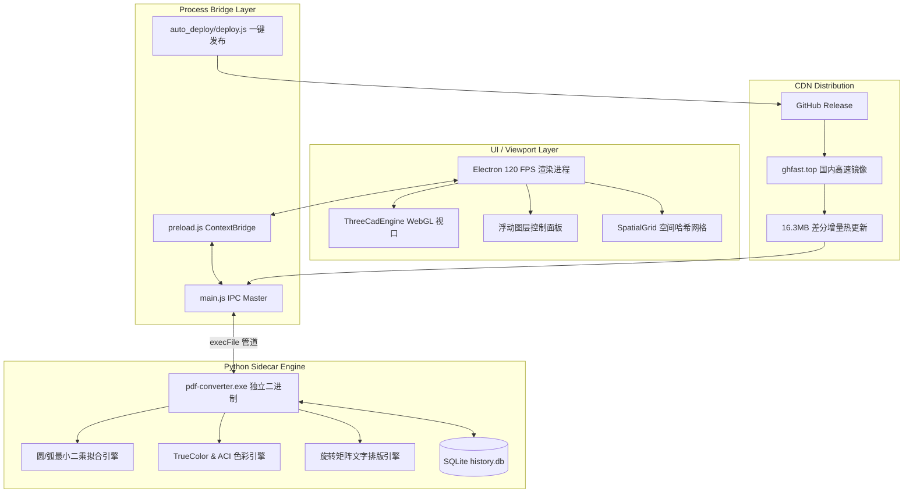

# PDF to CAD Converter 项目技术维基 (Wiki)

欢迎查阅 **PDF to CAD Converter Pro** 系统架构与技术维基。本项目致力于将矢量 PDF 电气工程与建筑图纸高精度、高保真地离线转换为标准 CAD DXF 格式，并提供基于 Three.js 的纯 GPU 加速视口引擎与差分热更新体系。

---

## 📚 维基文档索引导航

| 核心文档 | 内容概要 | 适用场景 |
| :--- | :--- | :--- |
| 🚀 **[v1.0.5 全量优化与架构发版指南](./v1.0.5_Optimization_and_Release.md)** | • 原生圆与圆弧拟合（CIRCLE/ARC）算法 • 24位 TrueColor + ACI 颜色双轨体系 • 根除文字重叠与真实角度倾斜旋转 • 图纸列表智能缓存与一键「重新转换」入口 • 全局高科技深色 UI 界面化（胶囊顶栏/赛博工作区/即时搜索） • 排除重复打包使安装包瘦身 55MB、差分包瘦身 70% | 了解最新 v1.0.5 重大技术突破、实测对比与版本发布信息 |
| ⚙️ **[系统实现方案与架构设计](./Implementation_Details.md)** | • 整体前后端 Sidecar 解耦架构 • 坐标系垂直镜像对齐公式 • 细长矩形双线收缩消除算法 • ThreeCadEngine WebGL 视口批处理与文字缓存 • SpatialGrid 空间哈希网格 O(1) 拾取与吸附 • 电气变电站图元拓扑自动聚类算法 | 查阅系统底层算法细节、渲染管线设计及数据结构 |
| ⚡ **[应用内自动升级与一键发布](./Auto_Update_and_Deploy.md)** | • 基于 GitHub Release 与国内 CDN 的更新通道 • 16MB 极速差分热更 (`update-patch-v*.zip`) 机制 • `auto_deploy/deploy.js` 自动化流水线 • 关键排坑记录与环境避雷指南 | 了解客户端检查更新逻辑、补丁热更原理及项目发布流程 |
| 🌐 **[DXF Web 查看器架构设计](./DXF_Web_Viewer.md)** | • `dxfview/` Vue3 + Vite + Three.js 独立网页版 • Web Worker 零拷贝多线程 DXF 解析管线 • 文字样式清洗与锚点对齐计算 • `vite-plugin-singlefile` 单文件自包含构建 | 查阅 Web 独立渲染方案或未来将组件嵌入第三方平台 |
| 🧩 **[局部子图导出架构设计](./Feature_Subgraph_Export_Architecture.md)** | • 节点图元拓扑关联抽取 • 独立子图重定中心与 DXF 单独序列化 • 模态框实时预览与另存管理 | 查阅变电站一次设备切片与子图模块化导出机制 |
| 🔌 **[第三方平台无缝集成规范](./Third_Party_Platform_Integration.md)** | • CLI 命令行参数与 JSON 通信协议 • 数据库 Schema 结构与对接字段 • 生产环境自动化运维方案 | 供第三方电气调度、资产管理系统对接转换引擎参考 |

---

## 🏗️ 总体技术栈拓扑

---

> 💡 **小贴士**：所有开发修改均需遵循各文档中的最佳实践规范，并在发布前统一运行 `npm run deploy` 自动走完构建瘦身、差分打包与 CDN 校验流程。
