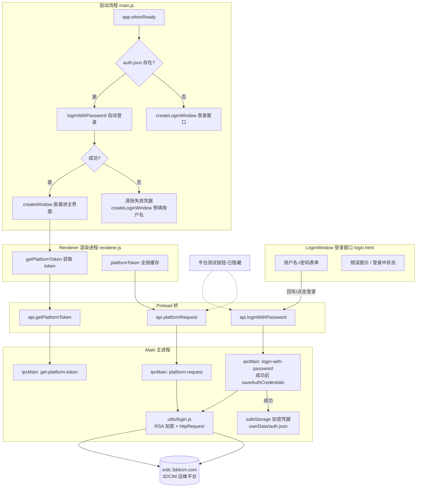

# 第三方平台对接架构 (Third-Party Platform Integration)

本文档记录与 3DCIM 运维平台（`http://xrdc.3ddcim.com/v1`）的登录鉴权与业务接口对接的完整链路实现，包括**登录界面（用户名+密码）**、RSA 密码加密、凭据持久化与启动自动登录、Token 管理、IPC 代理与连通性测试。

---

## 1. 业务需求与功能概述

- **登录界面**：应用启动时首先弹出登录窗口（与主窗口同尺寸），用户必须输入平台用户名和密码才能进入主界面；直接关闭登录窗口则退出应用；
- **记住登录状态**：登录成功后凭据加密保存（Electron `safeStorage` / Windows DPAPI），下次启动自动登录，直接进入主界面；自动登录失败时回退到登录窗口并预填用户名；
- **密码加密传输**：密码使用平台前端同款 RSA 公钥加密（PKCS#1 v1.5）后提交，与 `http://xrdc.3ddcim.com/#/login` 官方登录页行为完全一致；
- **统一请求代理**：后续所有平台接口调用统一走 IPC → 主进程 Node.js `http` 模块（规避渲染进程 `fetch` 的 CORS 限制），并自动携带鉴权凭据；
- **链路连通性测试**：保留「平台测试」验证逻辑（`btn-platform-test`），当前已从工具栏隐藏按钮，需要时可恢复。

---

## 2. 登录鉴权机制

### 2.1 密码登录（登录界面使用，`POST /v1/login`）

通过逆向平台官方登录页（`http://xrdc.3ddcim.com/#/login`，Vue 懒加载 chunk 14 模块 `T+/8`）确认：

- **密码必须 RSA 加密**：明文/MD5/SHA/Base64 均返回 `code:11 "密码加密异常"`；
- **RSA 公钥**（与平台前端 JSEncrypt 一致，硬编码）：

```
MIGfMA0GCSqGSIb3DQEBAQUAA4GNADCBiQKBgQDYoCx9RWP7A9hUIE4o88fkcx3NMyW+xiySOU0IMcKHs1vyo45FmAG2Qcs0KPBRK9vAjvy//ObY5ZB+xQCOVmzxIrTHpP7c128o9grDBbID84vGIc2wJQYCd0eiQWgKV54v7OQ8Psoq48PEBgBrTiMATKY+yIngfcgXqUDC8D2zawIDAQAB
```

- **请求**：`POST http://xrdc.3ddcim.com/v1/login`

```json
{
  "username": "yang",
  "password": "<RSA_PKCS1_v1_5加密后Base64>",
  "login_from": 0
}
```

- **Node 实现**（`utils/login.js` `rsaEncryptPassword`）：`crypto.publicEncrypt` + `RSA_PKCS1_PADDING`，公钥 DER→PEM 包装后加密；
- **错误码对照**（来自平台前端）：

| code | 含义 |
|---|---|
| 0 | 成功 |
| 9 | 用户未找到 |
| 11 | 密码加密异常（未按 RSA 加密） |
| 12 | 许可证（license）问题，平台弹出修改证书 |
| 13 | 登录请求无 login_from 信息 |
| 14 | 在线用户数太多 |
| 15 | 该时间段禁止访问 |
| 16 | 账户已被锁定（连续密码错误可能触发） |
| 17 | 登录密码错了（`login_error_password`） |
| 18 | 无效登录 |

### 2.2 签名登录（`POST /v1/SignLogin`，保留兼容）

平台 Web 端 SSO 使用的免密登录方式（时间戳 + 用户名 + 密钥盐 MD5 签名）：

```javascript
const timestamp = Math.floor(Date.now() / 1000);
const signature = md5(`${timestamp}_${username}_e4daded24a4a2b0e57d70ab52790deba`);
// POST http://xrdc.3ddcim.com/v1/SignLogin
// body: { signature, timestamp, username }
```

平台前端对 `admin`、`nijunwen` 等内置用户硬编码了同一密钥盐。应用保留 `login()`（`platform-login` IPC）但**启动流程已不再使用**。

### 2.3 响应结构与 Token 字段（两种登录相同）

登录成功（`code === 0`）时，响应体结构：

```json
{
  "code": 0,
  "message": "OK",
  "data": {
    "iAuthToken": "A51vLXwQJJ9Fpi2NatGsXcyA4TrfWH...",
    "user": { "id": 64, "name": "yang", "realname": "杨勇", ... },
    "role": [...]
  }
}
```

同时服务器通过 `Set-Cookie: xr3d_token=<token>` 下发会话（48 小时有效），**Cookie 中的 `xr3d_token` 与 `data.iAuthToken` 值相同**。

### 2.4 踩坑记录（重要）

| 问题 | 根因 | 修复 |
|---|---|---|
| 密码登录返回 `code:11 "密码加密异常"` | 密码必须 RSA(PKCS#1) 加密，MD5/SHA/Base64/明文均不行 | 逆向平台前端取得公钥，Node `crypto.publicEncrypt` 实现同款加密 |
| 加密后仍报 `login_error_password` | 不是加密问题，是密码本身错误（admin@123 在平台侧不对） | 换用真实账号密码验证通过 |
| `/login` 报 `login_from 不能为空` | 缺少 `login_from` 参数 | 传 `login_from: 0`（与平台 Web 登录页一致） |
| 登录返回 `code:2 "登录会话过期"` | URL 拼接重复：`PLATFORM_BASE` 已含 `/v1`，登录又拼 `/v1/SignLogin`，实际请求 `/v1/v1/SignLogin` | 登录路径改为 `/SignLogin`（拼接后为 `/v1/SignLogin`） |
| 取不到 token | 字段名不是 `data.token`，而是 `data.iAuthToken` | 成功判定 `code === 0 && data.iAuthToken` |
| 模块加载报 `SyntaxError: Unexpected token 'export'` | `utils/md5.js` 原为 ESM（`export default`），Electron 主进程按 CommonJS `require` 加载 | 末行改为 `module.exports = md5` |
| `getaddrinfo ENOTFOUND` | 代理/VPN 拦截 DNS 解析 | 关闭代理；基址从 `java.3ddcim.com` 改为 `xrdc.3ddcim.com` |

---

## 3. Token 传递方式（如何带过去）

平台服务端实际校验的是 **Cookie `xr3d_token`**。`httpRequest` 收到 token 参数时同时注入两种凭据头，双保险：

```javascript
if (token) {
  options.headers['Cookie'] = `xr3d_token=${token}`;      // 服务端实际校验
  options.headers['Authorization'] = `Bearer ${token}`;   // 兼容写法
}
```

---

## 4. 全链路架构



### 4.1 各文件职责

| 文件 | 职责 |
|---|---|
| `utils/md5.js` | MD5 摘要算法（纯 JS 实现，CommonJS 导出），仅签名登录使用 |
| `utils/login.js` | `rsaEncryptPassword`（RSA PKCS#1 密码加密）、`loginWithPassword`（密码登录，返回 `{success, token, data}`）、`login`（签名登录，保留）、`httpRequest`（Node http 通用请求，带 Cookie/Bearer）；`PLATFORM_BASE = 'http://xrdc.3ddcim.com/v1'` |
| `login.html` | 登录窗口页面（与主窗口同尺寸 1400×850，卡片居中，深色科技风）；支持 `?u=<用户名>` 查询参数预填用户名；回车提交；错误提示与"登录中"状态 |
| `main.js` | 启动流程（凭据检测→自动登录/登录窗口）；`Menu.setApplicationMenu(null)` 隐藏菜单栏；IPC `login-with-password`（成功后缓存 token、保存凭据、开主窗口关登录窗口）；`get-platform-token`；凭据持久化 `saveAuthCredentials` / `loadAuthCredentials` / `clearAuthCredentials`（safeStorage + `userData/auth.json`） |
| `preload.js` | `contextBridge` 暴露 `window.api.loginWithPassword(u, p)` / `getPlatformToken()` / `platformRequest(params)` |
| `renderer.js` | `initPlatform` 启动时从主进程获取已登录 token（不再自动登录）、`platformToken` 全局变量；平台测试弹窗渲染逻辑保留（按钮已隐藏） |
| `index.html` / `index.css` | 主界面；「平台测试」按钮已从工具栏移除 |

### 4.2 凭据持久化细节

- 存储位置：`app.getPath('userData')/auth.json`（Windows 为 `%APPDATA%/pdf-to-cad/auth.json`）；
- 内容：`{ username, password: <safeStorage.encryptString 后 Base64> }`；
- Windows 使用 DPAPI，**与当前系统用户绑定**，换用户/换机器无法解密；
- 自动登录失败（密码被改、账号锁定、网络异常）时**自动删除失效凭据**并弹出登录窗口（用户名预填）；
- 如需强制重新登录：手动删除 `auth.json` 即可。

---

## 5. 启动登录流程（时序）

1. `app.whenReady` → 隐藏应用菜单 → 读取 `auth.json`；
2. 无凭据 → 显示登录窗口；
3. 有凭据 → 主进程静默调 `loginWithPassword`；
   - 成功：缓存 `platformToken` → 直接打开主窗口（渲染进程通过 `get-platform-token` 拿 token）；
   - 失败：删除凭据 → 打开登录窗口（预填用户名）；
4. 登录窗口提交 → IPC `login-with-password` → RSA 加密密码 → `POST /v1/login`；
   - 成功：保存凭据 → 开主窗口 → 关登录窗口；
   - 失败：登录窗口显示平台错误信息（用户未找到 / 登录密码错了 / 账户已被锁定等）；
5. 登录窗口被用户直接关闭（未登录）→ 应用退出。

---

## 6. 后续业务接口对接规范

渲染进程统一调用模式：

```javascript
const res = await window.api.platformRequest({
  url: '/topology/topos/',   // 自动拼接 http://xrdc.3ddcim.com/v1 前缀
  method: 'GET',
  token: platformToken,      // 主进程登录后缓存、渲染进程初始化时获取的全局 token
  data: { ... },             // POST body（GET 可省略）
});
// res = { success: true, data: { code: 0, data: {...} } }
// res.data.data.items → 业务数据
```

注意事项：
- 判定业务成功用 `res.data.code === 0`；非 0 通常意味着会话过期，应用重启即可自动重新登录（凭据已保存）；
- 登录会话有效期 48 小时（Cookie `Max-Age=172800`），应用每次启动都会自动重新登录，正常使用无需关心过期。

### 6.1 云端文件列表（历史记录面板，`GET /v1/folder/files`）

> 已接入（2026-08-31）：历史记录弹窗的数据源已由本地 SQLite 切换为本接口。

```
GET /v1/folder/files?folder_id=4
```

返回**两层结构**：外层只有原始文件（PDF），转出来的 CAD 挂在 `children` 里。

```json
{
  "code": 0,
  "data": [
    {
      "id": 37,
      "file_name": "图纸.pdf",
      "file_size": 167389,
      "file_type": "application/pdf",
      "source_file_id": null,
      "child_count": 2,
      "children": [
        { "id": 41, "file_name": "图纸.dwg", "file_size": 88123, "source_file_id": 37 },
        { "id": 42, "file_name": "图纸修改版.dwg", "file_size": 91002, "source_file_id": 37 }
      ]
    }
  ]
}
```

字段约定：
- `source_file_id === null` → 原始文件（PDF）；非 null → CAD 子文件；
- `child_count` 为 0 时不显示展开箭头；`file_size` 字节准确，可用于下载后核对；
- 预留：每个 PDF 行可挂「上传编辑后文件」入口，用该行 `id` 作为 `source_file_id` 上传（接口规格待平台提供，暂未实现）。

客户端实现位置：
- IPC：`main.js` → `platform-list-folder-files`（带 token 请求，`code===0` 时返回 `{ success: true, data: [...] }`）；
- 渲染：`renderer.js` → `loadHistory()`（两层渲染：PDF 主行 + `children` 缩进明细行，已转换 CAD 图纸提供「打开 CAD」、「重新转换」与「清除缓存」三项操作）。

## 7. 验证脚本

`utils/test_module.js`（验证签名登录模块）、`utils/test_topos.js`（验证登录 + 拓扑列表接口）为 Node 直跑脚本：

```powershell
node utils/test_module.js
node utils/test_topos.js
```

密码登录验证（临时脚本示例）：

```javascript
const { loginWithPassword } = require('./utils/login');
loginWithPassword('yang', '<密码>').then(console.log);
```

实测记录（2026-08-29）：
- `admin / admin@123` → 平台返回 `login_error_password`（官方 `#/login` 页面同样无法登录，密码本身不对）；
- `yang / &Yong924.` → 登录成功，用户「杨勇」，token 正常下发。
