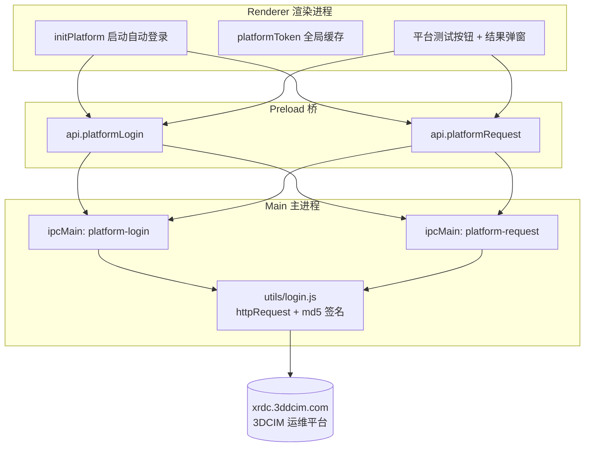

# 第三方平台对接架构 (Third-Party Platform Integration)

本文档记录与 3DCIM 运维平台（`http://xrdc.3ddcim.com/v1`）的登录鉴权与业务接口对接的完整链路实现，包括签名登录、Token 管理、IPC 代理与连通性测试。

---

## 1. 业务需求与功能概述

- **自动登录**：应用启动初始化时静默登录第三方平台，拿到会话 Token（不阻塞应用启动，失败仅告警）；
- **统一请求代理**：后续所有平台接口调用统一走 IPC → 主进程 Node.js `http` 模块（规避渲染进程 `fetch` 的 CORS 限制），并自动携带鉴权凭据；
- **链路连通性测试**：工具栏提供「平台测试」按钮，一键验证「登录 + 业务接口调用」全链路，弹窗展示结果。

---

## 2. 登录鉴权机制

### 2.1 签名算法（`utils/login.js`）

平台登录采用 **时间戳 + 用户名 + 密钥盐 的 MD5 签名**，无需明文密码：

```javascript
const timestamp = Math.floor(Date.now() / 1000);
const signature = md5(`${timestamp}_nijunwen_e4daded24a4a2b0e57d70ab52790deba`);
// POST http://xrdc.3ddcim.com/v1/SignLogin
// body: { signature, timestamp, username: "nijunwen" }
```

### 2.2 响应结构与 Token 字段

登录成功（`code === 0`）时，响应体结构：

```json
{
  "code": 0,
  "message": "OK",
  "data": {
    "iAuthToken": "TulEMFwU4YiYxtRRFQjcAI0garGomuw4...",
    "user": { "id": 64, "name": "nijunwen", "realname": "倪俊文", ... },
    "role": [...]
  }
}
```

同时服务器通过 `Set-Cookie: xr3d_token=<token>; Max-Age=172800` 下发会话（48 小时有效），**Cookie 中的 `xr3d_token` 与 `data.iAuthToken` 值相同**。

### 2.3 踩坑记录（重要）

| 问题 | 根因 | 修复 |
|---|---|---|
| 登录返回 `code:2 "登录会话过期"` | URL 拼接重复：`PLATFORM_BASE` 已含 `/v1`，登录又拼 `/v1/SignLogin`，实际请求 `/v1/v1/SignLogin` | 登录路径改为 `/SignLogin`（拼接后为 `/v1/SignLogin`） |
| 取不到 token | 字段名不是 `data.token`，而是 `data.iAuthToken` | 成功判定 `code === 0 && data.iAuthToken` |
| 模块加载报 `SyntaxError: Unexpected token 'export'` | `utils/md5.js` 原为 ESM（`export default`），Electron 主进程按 CommonJS `require` 加载 | 末行改为 `module.exports = md5` |
| `getaddrinfo ENOTFOUND` | 代理/VPN 拦截 DNS 解析 | 关闭代理；基址从 `java.3ddcim.com` 改为 `xrdc.3ddcim.com` |

---

## 3. Token 传递方式（如何带过去）

平台服务端实际校验的是 **Cookie `xr3d_token`**。`httpRequest` 收到 token 参数时同时注入两种凭据头，双保险：

```javascript
if (token) {
  options.headers['Cookie'] = `xr3d_token=${token}`;      // 服务端实际校验
  options.headers['Authorization'] = `Bearer ${token}`;   // 兼容写法
}
```

---

## 4. 全链路架构



### 4.1 各文件职责

| 文件 | 职责 |
|---|---|
| `utils/md5.js` | MD5 摘要算法（纯 JS 实现，CommonJS 导出） |
| `utils/login.js` | `httpRequest`（Node http 通用请求，带 Cookie/Bearer）、`login`（签名登录，返回 `{success, token, data}`）；`PLATFORM_BASE = 'http://xrdc.3ddcim.com/v1'` |
| `main.js` | IPC handler `platform-login`（调 `login`）与 `platform-request`（调 `httpRequest`，透传 `{url, method, data, token}`） |
| `preload.js` | `contextBridge` 暴露 `window.api.platformLogin()` / `window.api.platformRequest(params)` |
| `renderer.js` | `initPlatform` 自执行（启动静默登录）、`platformToken` 全局变量、测试按钮交互与结果弹窗渲染 |
| `index.html` / `index.css` | 「平台测试」按钮、`#platform-test-modal` 结果弹窗、`.pt-*` 弹窗样式 |

---

## 5. 平台测试按钮（链路验证）

点击「平台测试」按钮执行三步验证，结果渲染至弹窗：

1. **登录**：无缓存 token 时调 `platformLogin`；已有缓存则复用；
2. **业务接口**：携带 Cookie 调 `GET /v1/topology/topos/`（拓扑列表）验证 token 传递有效性；若返回 `code !== 0`（会话过期）则**自动重登一次再重试**；
3. **弹窗展示**：Section 1 显示登录用户名 / Token 前缀，Section 2 显示拓扑条数与前 10 条列表（名称、id、type）。

实测结果（2026-08-27）：登录用户「倪俊文 (nijunwen) / 超级管理员」，拓扑列表返回 `code:0` 共 18 条（网络拓扑示意图、US Power Supply 1/2、业务拓扑、应用墙等）。

---

## 6. 后续业务接口对接规范

渲染进程统一调用模式：

```javascript
const res = await window.api.platformRequest({
  url: '/topology/topos/',   // 自动拼接 http://xrdc.3ddcim.com/v1 前缀
  method: 'GET',
  token: platformToken,      // 初始化登录时缓存的全局 token
  data: { ... },             // POST body（GET 可省略）
});
// res = { success: true, data: { code: 0, data: {...} } }
// res.data.data.items → 业务数据
```

注意事项：
- 判定业务成功用 `res.data.code === 0`；非 0 通常意味着会话过期，应重新 `platformLogin` 刷新 `platformToken` 后重试；
- 登录会话有效期 48 小时（Cookie `Max-Age=172800`），但应用每次启动都会重新登录，正常使用无需关心过期。

## 7. 验证脚本

`utils/test_module.js`（验证登录模块）、`utils/test_topos.js`（验证登录 + 拓扑列表接口）为 Node 直跑脚本，可随时复跑：

```powershell
node utils/test_module.js
node utils/test_topos.js
```
